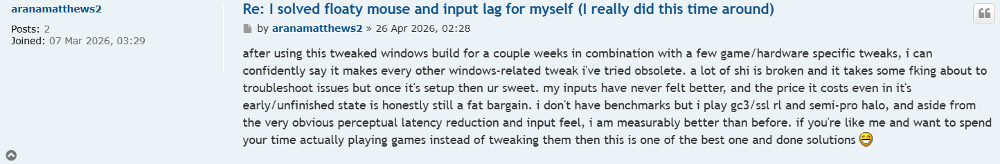

# Hyote

**// tweaker**

## Custom ISO

**The public files are a fraction of what's inside.**

The public repos show the surface - scripts, configs, a few utilities. What I offer is a stripped and hardened Windows 11 ISO with registry edits and kernel drivers that aren't published anywhere, automated hardware tuning, and an integrated tool that makes it all work together without needing to touch settings anymore.

## [Get it on Patreon](https://hyyote.github.io)

# Get your system tweaked by Proviise, now with full BIOS coverage: https://discord.gg/U2RK9KKUBd
